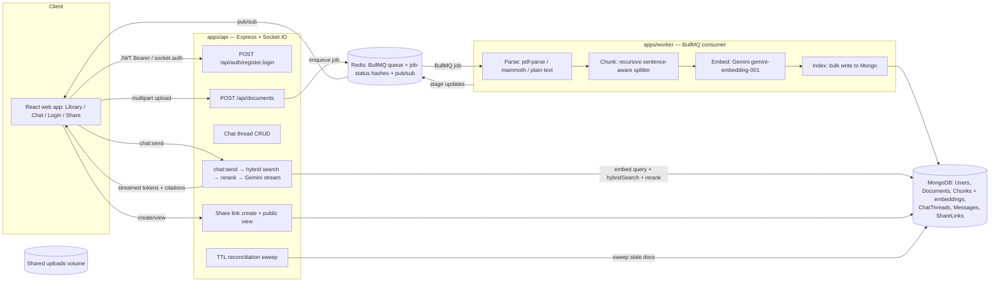

# DocMind

A production-grade RAG (Retrieval-Augmented Generation) document Q&A platform. Upload PDFs,
DOCX, TXT, or Markdown files; DocMind parses, chunks, embeds, and indexes them asynchronously,
then lets you chat with your documents using hybrid search, inline citations, and multi-turn
memory — all behind per-user auth with shareable read-only links.

**Status:** Phases 1–3 are implemented and tested — ingestion pipeline, hybrid retrieval +
streamed chat with citations, and JWT auth/multi-tenancy/share links. The extra features (rate
limiting, eval harness, analytics dashboard, etc.) are planned — see [Roadmap](#roadmap).

## Architecture



**Repo layout** (npm workspaces monorepo):

```
DocMind/
  packages/shared/   # types, chunking splitter, hybrid retrieval (cosine/BM25/RRF),
                      # embedding provider, Mongoose models, Redis job-status helpers,
                      # TTL reconciliation sweep, logger — shared by api + worker
  apps/api/           # Express REST API + Socket.IO: auth, documents, chat, share links
  apps/worker/        # BullMQ worker: parse → chunk → embed → index → notify pipeline
  apps/web/           # React (Vite) app: Library, Chat, Login, public Share page
  infra/atlas/        # Vector Search + Search index JSON definitions + setup instructions
  benchmarks/         # micro + end-to-end benchmark scripts (see Benchmarks section below)
```

## Getting started

### 1. MongoDB

Hybrid retrieval works out of the box against a **local `mongod`** — it auto-detects whether
Atlas-only aggregation stages (`$vectorSearch`/`$search`) are available and falls back to an
in-process cosine + BM25 implementation if not (see
[Design decisions](#why-hybrid-search-that-works-locally-and-on-atlas)). Point `MONGODB_URI` at
either:
- a local `mongod` (`mongodb://127.0.0.1:27017/docmind`) — works immediately, no setup; or
- a real **MongoDB Atlas** cluster (free M0 tier) for native Vector Search/`$search` — see
  [`infra/atlas/README.md`](infra/atlas/README.md) for index setup.

Because of this, `docker-compose` runs `redis`, `api`, and `worker` only — not a Mongo container.

### 2. Configure environment

```bash
cp .env.example .env
# Fill in MONGODB_URI, GEMINI_API_KEY, and JWT_SECRET
```

### 3. Run locally with Docker Compose

```bash
npm install          # first time only, so local tooling (tsc, vitest) works outside containers
docker compose up --build
```

The API listens on `http://localhost:4000`. Run the web app separately for now:

```bash
npm run dev:web       # http://localhost:5173, proxies /api and /socket.io to :4000
```

### 4. Or run everything without Docker

```bash
npm install
npm run dev:api        # terminal 1 (needs local Redis + Mongo running)
npm run dev:worker      # terminal 2
npm run dev:web         # terminal 3
```

### 5. Try it

Register an account at `http://localhost:5173/login` (or run `npm run seed:admin --workspace @docmind/api`
for a quick local login: username `admin`, password `admin` — **local dev only**, never run this
against a shared/production database), upload a PDF/DOCX/TXT/MD file, watch it move through
`queued → parsing → chunking → embedding → indexing → completed`, then go to **Chat**, pick a
document scope (or "all documents"), and ask a question — the answer streams in token-by-token
with clickable citation chips linking back to the source page. Login accepts either an email or a
username.

### Testing

```bash
npm test                # unit + integration tests across all workspaces
```

Integration tests use `mongodb-memory-server` (no real Atlas/Mongo needed) and a real Redis
instance for BullMQ, plus a mocked Gemini client (via `vi.spyOn` on the exported provider
instances) — no real API key or network calls needed in CI.

## API

| Method | Path                          | Auth | Description                                      |
| ------ | ----------------------------- | :--: | ------------------------------------------------- |
| POST   | `/api/auth/register`          | –    | Create an account (`email`, `password`, optional `username`/`name`), returns a JWT + user. |
| POST   | `/api/auth/login`             | –    | Log in with `{ identifier, password }` — `identifier` matches either `email` or `username`. |
| GET    | `/api/auth/me`                | ✓    | Current user for a given token.                    |
| POST   | `/api/documents`               | ✓    | Upload a file (`multipart/form-data`, field `file`). Returns `202` + the created document. |
| GET    | `/api/documents`               | ✓    | List the current user's documents.                 |
| GET    | `/api/documents/:id`           | ✓    | Fetch a single document's metadata/status.         |
| GET    | `/api/documents/:id/status`    | ✓    | Poll ingestion progress (also pushed via Socket.IO `job:progress`). |
| DELETE | `/api/documents/:id`           | ✓    | Delete a document, its chunks, and its stored file. |
| POST   | `/api/documents/:id/share`     | ✓    | Create a read-only share link (optionally attaching a chat thread). |
| GET    | `/api/public/share/:token`     | –    | Public read-only view of a shared document + chat. |
| GET    | `/api/public/share/:token/export.pdf` | – | Download the shared chat as a PDF. |
| POST   | `/api/chat/threads`             | ✓    | Create a chat thread, optionally scoped to specific `documentIds` (omitted = all documents). |
| GET    | `/api/chat/threads`             | ✓    | List the current user's threads.                   |
| GET    | `/api/chat/threads/:id`         | ✓    | Thread detail + full message history.              |
| PATCH  | `/api/chat/threads/:id`         | ✓    | Update which `documentIds` an existing thread references (change scope mid-conversation). |
| DELETE | `/api/chat/threads/:id`         | ✓    | Delete a thread and its messages.                  |
| GET    | `/api/chat/threads/:id/export.pdf` | ✓ | Download the thread's transcript (with citations) as a PDF. |
| GET    | `/health`                      | –    | Liveness check (Mongo + Redis connectivity).       |

**Socket.IO** (auth via `io(url, { auth: { token } })`, verified in a connection middleware):
`subscribe`/`unsubscribe` (ingestion progress rooms, ownership-checked), `chat:send` →
`chat:token` (streamed) → `chat:done` (persisted messages + citations) or `chat:error`.

A formal OpenAPI spec will be added alongside Phase 4.

## Benchmarks

Real numbers, measured against a fully live local stack (API + worker + Mongo + Redis + Ollama),
not estimates. Reproduce with:

```bash
npm run bench:micro    # pure-compute: chunking, cosine similarity, BM25, RRF
npm run bench:live     # end-to-end: ingestion, hybrid search, chat, HTTP load (needs the stack running)
```

**Environment:** Apple M1 (8 cores, 8 GB RAM), macOS 26.5.2, Node v20.13.1, MongoDB 7.0.8 (local,
non-Atlas — so hybrid search below ran the in-process fallback path, not `$vectorSearch`/`$search`),
Redis 8.8.1, embeddings via `gemini-embedding-001`, generation via a local Ollama `llama3.2`
(CPU/Metal inference, no GPU). These are local-dev-machine numbers, not a production SLA — re-run
`npm run bench` on your own hardware/infra before citing them anywhere that matters.

### Pure compute (`bench:micro`)

| Component | Result |
| --- | --- |
| Chunking splitter (`splitText`) | 109–171 MB/s depending on document size (1 MB doc → 1,540 chunks in 8.9 ms) |
| Cosine similarity (3072-dim) | p50 7 µs, ~110k–140k ops/sec |
| BM25 scoring | 1000-chunk corpus: p50 13.7 ms/query (~72 queries/sec) |
| Reciprocal rank fusion | 1000 candidates/list: p50 0.9 ms (~1,070 fusions/sec) |

Takeaway: none of hybrid search's own scoring/fusion math is the bottleneck at these corpus
sizes — BM25's linear IDF pass over the corpus is the most expensive piece, and even that's
sub-15ms at 1,000 chunks. Real hybrid-search latency (below) is dominated by fetching candidates
from Mongo, not by scoring them.

### End-to-end (`bench:live`)

**Ingestion** (upload → parse → chunk → embed → index, real Gemini embedding calls):

| File size | Total time | Notes |
| --- | --- | --- |
| 2 KB | 763 ms | |
| 20 KB | 1,927 ms | |
| 100 KB | *failed* | Hit Gemini's free-tier embedding quota (100 requests/minute) after the first two uploads in the same run — a real, reproducible constraint, not a code bug. Space uploads out (or use a paid tier) if you're ingesting several documents back to back. |

**Hybrid search** (in-process fallback path — cosine + BM25 + RRF over chunks fetched from Mongo):

| Corpus size | p50 | p95 |
| --- | --- | --- |
| 50 chunks | 15 ms | 59 ms |
| 200 chunks | 52 ms | 97 ms |
| 1,000 chunks | 243 ms | 283 ms |

This scales roughly linearly with corpus size, as expected for the brute-force fallback path (it
fetches every scoped chunk from Mongo rather than using an ANN index) — see
[why hybrid search works locally and on Atlas](#design-decisions). A real Atlas cluster's
`$vectorSearch` would be expected to scale sub-linearly past a few thousand chunks; that's not
measurable without a real Atlas cluster, so it isn't claimed here.

**Chat** (real embedding + hybrid search + rerank + generation, local Ollama `llama3.2`):

| Metric | p50 | p95 |
| --- | --- | --- |
| Time to first token | 12.6 s | 19.4 s |
| Time to full answer | 16.4 s | 22.6 s |

This is almost entirely Ollama generation time on unaccelerated local CPU/Metal inference on an
8 GB M1 — not retrieval (which is tens of milliseconds per the table above). Swapping
`LLM_PROVIDER=gemini` with a working paid-tier key, or running Ollama on a machine with more RAM
or a dedicated GPU, would change this number substantially; it says more about this laptop than
about the retrieval/generation architecture.

**HTTP load** (`autocannon`, 10 connections × 10 s):

| Endpoint | Throughput | p50 | p99 |
| --- | --- | --- | --- |
| `GET /health` | 6,164 req/sec | 1 ms | 4 ms |
| `GET /api/documents` (authed) | 1,039 req/sec | 8 ms | 31 ms |

## Design decisions

**Why does every router get its own mount prefix (`/api/documents`, `/api/chat`,
`/api/public/share`) instead of all sharing `/api`?** This fixed a real bug: routers were
originally all mounted at a shared `/api` prefix with each one's own internal route paths
(`/documents`, `/chat/threads`, `/public/share/:token`, ...). `documentsRouter` and `chatRouter`
each apply `router.use(requireAuth)` with no path filter — and in Express, a path-less `.use()`
middleware runs for *every* request that reaches that router, not just ones matching a route
defined later in the same file. Since `documentsRouter` was mounted first, it intercepted **every**
request under `/api`, including the deliberately public `/api/public/share/:token` — silently
turning "public" into "401 Unauthorized" for anyone without a token. Integration tests caught it
(`apps/api/tests/share.test.ts`). The fix: give each router a distinct, non-overlapping mount
prefix in `app.ts`, so Express decides which router handles a request *before* that router's own
middleware ever runs — a public router mounted at `/api/public/share` is structurally unreachable
from an unrelated router's auth check, rather than merely unlikely to collide with it.

**Why can you edit a thread's document scope after creation, not just at start?** Real
conversations often need to narrow or widen what's being searched mid-thread (e.g. start broad,
then focus on one document once you find the relevant one). `PATCH /api/chat/threads/:id`
updates the persisted `documentIds`; the next question asked in that thread uses the new scope
immediately — no need to start a new conversation just to change what it can see.

**Why PDF export via `pdfkit` instead of rendering HTML with a headless browser?** A chat
transcript is simple, structured text (role labels, message bodies, a citation list) — it doesn't
need CSS layout or JS execution to look right. `pdfkit` draws it directly with a small, pure-JS
dependency; a Puppeteer-based approach would drag in a full Chromium download for a document this
simple. The same `streamChatPdf` (`apps/api/src/services/pdfExport.ts`) backs both the
authenticated per-thread export and the public share-link export, so the two never drift apart.

**Why an async pipeline instead of processing uploads inline?** Parsing, chunking, and embedding
a large PDF can take tens of seconds — well past what an HTTP client should block on. The API
returns `202 Accepted` immediately after persisting the file and enqueuing a BullMQ job; a
separate worker process does the actual work and reports progress through a Redis status hash
(`job:status:{documentId}`), which the frontend can poll or receive over Socket.IO. This also lets
the worker scale independently of the API and survive API restarts mid-job.

**Why hybrid search that works locally *and* on Atlas?** Atlas Vector Search/`$search` only exist
on real Atlas clusters, but requiring one just to see retrieval work would make the project
unusable out of the box. `hybridSearch` (`packages/shared/src/retrieval/hybridSearch.ts`) probes
once per process whether `$vectorSearch` is supported and transparently falls back to an
in-process implementation — fetching the scoped chunks directly, scoring them with an exact
`cosineSimilarity` and a homemade BM25 (`packages/shared/src/retrieval/bm25.ts`), then merging
both rankings with Reciprocal Rank Fusion (`rrf.ts`). Both paths score and fuse identically; only
how the initial candidate pool is gathered differs. A cosine-similarity floor is applied after
fusion, not before, so thresholding is always exact regardless of which path ran.

**Why is `SIMILARITY_THRESHOLD` 0.55, not the textbook 0.7?** 0.7 is a common rule of thumb, but
it isn't a universal constant — it depends on the embedding model. We measured it directly:
`gemini-embedding-001` scores genuinely relevant question/passage pairs around 0.55–0.70 and
clearly irrelevant ones around 0.45–0.50 for this corpus. A 0.7 floor rejected almost every real
query in testing; 0.55 keeps the "reject irrelevant chunks" behavior the threshold exists for
while not silently discarding valid matches for this specific model. If you swap embedding
providers, re-measure rather than assuming 0.7 (or any other number) transfers over.

**Why LLM-based reranking instead of a cross-encoder model?** Running a dedicated cross-encoder
means shipping and serving a second ML model. A single cheap Gemini Flash-Lite call
(`apps/api/src/services/rerank.ts`) that scores the RRF candidates 0–10 gets most of the quality
benefit with no extra infrastructure, and fails open (falls back to the RRF order) if the call or
JSON parse ever breaks — reranking is a quality knob, not a correctness dependency.

**Why Socket.IO for chat streaming instead of SSE?** Socket.IO was already wired up for ingestion
progress push. Reusing it for `chat:send`/`chat:token`/`chat:done` avoids a second real-time
transport for one feature, and its connection-level `io.use()` middleware gives JWT-authenticated
handshakes for free — the same `verifyAuthToken` helper backs both the HTTP `requireAuth`
middleware and the socket auth middleware (`apps/api/src/sockets/socketAuth.ts`).

**Why a single 7-day JWT instead of an access/refresh token pair?** A refresh-rotation scheme
(short-lived access token, long-lived refresh token, rotation, revocation) is real production
hardening, but it's disproportionate complexity for what's been asked so far — deliberately
simple for now, called out here rather than silently skipped.

**Why a custom recursive/sentence-aware chunker instead of fixed-size cuts?** Fixed-size chunking
routinely slices sentences (and citations) in half, hurting both retrieval relevance and answer
quality. The splitter (`packages/shared/src/chunking/splitText.ts`) tries paragraph breaks first,
then sentence punctuation, then words, and only falls back to a hard character cut if a run of
text has no natural boundary at all — while tracking exact character offsets so every chunk can
be mapped back to its source page/line for citations.

**Why chunk per-page for PDFs?** `pdf-parse`'s `pagerender` hook lets us capture text per page
before it's concatenated, so each chunk is tagged with the page it actually came from — that page
number flows straight through retrieval into the citation chips shown in chat. DOCX/TXT/MD don't
have a native page concept, so those formats get line-number metadata instead.

**Why default both embeddings and generation to Gemini — but support Ollama for generation too?**
Both live behind provider interfaces (`EmbeddingProvider` in `packages/shared/src/llm/`,
`GenerationProvider` in `apps/api/src/providers/generationProvider.ts`), so one vendor keeps local
dev to a single API key. In practice, embeddings and generation are billed/quota'd *separately* on
Gemini — a key can embed fine while having zero generation quota (this happened during
development). Rather than block on that, `createGenerationProvider(LLM_PROVIDER, ...)` also
supports `ollama`: a free, unlimited, local model server, same interface, one env var to switch
(`LLM_PROVIDER=ollama`). Reranking (`apps/api/src/services/rerank.ts`) still always calls Gemini
directly regardless of `LLM_PROVIDER` — it's a single cheap call and already fails open, so it
wasn't worth routing through the same provider abstraction; set `RERANK_ENABLED=false` if your
Gemini key has no generation quota at all.

**Why hash-based dedup at upload time?** Re-embedding an identical file a user already uploaded
wastes both money and time. `ingestUpload` (`apps/api/src/services/documentService.ts`) hashes
the incoming file (SHA-256) and, if a completed document with the same hash already exists for
that owner, short-circuits: it copies the existing chunk rows (embeddings included) instead of
re-running the pipeline.

**Why a `setInterval` reconciliation sweep in the API process instead of a BullMQ repeatable job
on the worker?** If the *worker* crashes mid-job, a reconciliation job running inside that same
worker process would die with it — defeating the purpose. Running the sweep
(`packages/shared/src/reconciliation/ttlSweep.ts`) from the longer-lived API process means it
keeps checking for orphaned jobs even if the worker is down, and reconciles them: marks the
document `failed`, deletes partial chunks, and clears the stale Redis status hash.

## Roadmap

- **Phase 1 — Ingestion:** ✅ async parse → chunk → embed → index pipeline, live progress, TTL
  reconciliation, hash-based dedup.
- **Phase 2 — Retrieval & generation:** ✅ hybrid search (dense + BM25 via RRF, with an Atlas/local
  auto-fallback), similarity thresholding, LLM-based reranking, Socket.IO token streaming,
  multi-document/collection chat, inline citations, conversation memory.
- **Phase 3 — Auth & multi-tenancy:** ✅ JWT auth, per-user document/chat isolation, shareable
  read-only links.
- **Phase 4 — Extras (planned):** rate limiting & cost tracking, query-result caching, RAGAS-style
  eval harness, feedback loop (thumbs up/down), admin/analytics dashboard, chat export, voice
  input, prompt-injection and PII guardrails, Prometheus `/metrics`, load testing.
